# AI Workshop Playground

> Transform ideas into code with AI-powered web development

An interactive web-based IDE designed for workshops and learning environments. Participants describe what they want to build using natural language, and AI generates production-ready HTML, CSS, and JavaScript code in real-time.


_Three-panel interface: Chat with AI, edit code, see live results_

## ✨ What is This?

AI Workshop Playground is an educational tool that makes web development accessible to everyone. Whether you're teaching a coding workshop, learning web development, or experimenting with AI-assisted programming, this platform provides:

- **Natural Language to Code**: Describe what you want in plain English (or Finnish!)
- **Real-time Generation**: Watch as AI writes code line-by-line in a professional code editor
- **Instant Preview**: See your creations come to life immediately in a live preview panel
- **Workshop-Ready**: Built-in authentication and usage limits for classroom settings

### Perfect For

- 👨‍🏫 **Instructors** running coding workshops or bootcamps
- 🎓 **Students** learning web development fundamentals
- 🧪 **Developers** experimenting with AI-assisted coding
- 🎪 **Event Organizers** hosting hackathons or tech demos

## 🚀 Quick Start

### Using Docker (Recommended)

The easiest way to get started:

```bash
# 1. Clone the repository
git clone https://github.com/yourusername/ai-workshop-playground.git
cd ai-workshop-playground

# 2. Set up your environment
cp .env.example .env
# Edit .env and add your GEMINI_API_KEY and ADMIN_SECRET

# 3. Start everything with Docker Compose
docker-compose up --build

# 4. Open your browser
# Visit http://localhost:3000
```

That's it! The application will start with:

- Frontend running on `http://localhost:3000`
- Backend API on `http://localhost:5000`
- MongoDB database ready to go

### Manual Setup

If you prefer to run services individually:

**Prerequisites:**

- Node.js 18 or higher
- MongoDB running locally or in Docker
- Google Gemini API key ([get one free](https://makersuite.google.com/app/apikey))

```bash
# Start MongoDB
docker run -d -p 27017:27017 mongo:latest

# Start the backend
cd backend
npm install
cp .env.example .env  # Add your GEMINI_API_KEY
npm run dev

# In another terminal, start the frontend
cd frontend
npm install
npm run dev
```

Visit `http://localhost:3000` and you're ready to create!

## 🎯 How It Works

```mermaid
graph LR
    A[👤 User] -->|Types prompt| B[💬 Chat Panel]
    B -->|Sends request| C[🤖 AI Backend]
    C -->|Streams code| D[📝 Code Editor]
    D -->|Auto-updates| E[👁️ Live Preview]
    E -->|Shows result| A
```



1. **Enter a Workshop Password**: Your instructor provides a password to access the platform
2. **Describe Your Idea**: Type what you want to build (e.g., "Create a colorful portfolio page")
3. **Watch AI Generate**: Code streams into the editor in real-time
4. **See It Live**: Your creation appears instantly in the preview panel
5. **Iterate**: Ask for changes, and AI modifies the existing code

## 🎨 Features

### For Participants

- **Three-Panel IDE**: Professional development environment with chat, code editor (Monaco), and live preview
- **Smart AI Assistant**: Powered by Google Gemini 2.5 Flash for fast, high-quality code generation
- **Template Library**: Start with pre-built templates or generate from scratch
- **Code Editing**: Full Monaco editor with syntax highlighting, auto-formatting, and undo/redo
- **Bilingual**: Full support for English and Finnish interfaces

### For Instructors

- **Admin Dashboard** (`/admin`): Manage workshops from a web interface
- **Workshop Passwords**: Create time-limited passwords with configurable usage limits
- **Usage Tracking**: Monitor how many requests each participant has made
- **Rate Limiting**: Prevent abuse with per-machine limits
- **Usage Statistics**: See real-time workshop engagement metrics

## 🔐 Setting Up a Workshop

As an instructor, you'll want to create workshop passwords for your participants:

### Using the Admin Dashboard

1. Navigate to `http://localhost:3000/admin`
2. Enter your `ADMIN_SECRET`
3. Click "Create New Password"
4. Set:
   - Password code (e.g., "WORKSHOP2024")
   - Expiration date
   - Max uses per participant (default: 20)
5. Share the password with participants

### Using the API

```bash
curl -X POST http://localhost:5000/api/admin/passwords \
  -H "Content-Type: application/json" \
  -H "X-Admin-Secret: your-admin-secret" \
  -d '{
    "code": "SPRING2026",
    "expiresAt": "2026-06-30T23:59:59Z",
    "maxUsesPerUser": 30
  }'
```

## 📁 Project Structure

```
ai-workshop-playground/
├── backend/           # Express.js API server
│   ├── src/
│   │   ├── controllers/   # AI generation & admin logic
│   │   ├── middleware/    # Auth & rate limiting
│   │   ├── models/        # Database schemas
│   │   └── routes/        # API endpoints
│   └── Dockerfile
├── frontend/          # Next.js React application
│   ├── src/
│   │   ├── app/          # Pages (main workspace & admin)
│   │   ├── components/   # UI components
│   │   ├── hooks/        # React hooks
│   │   └── lib/          # API client & utilities
│   └── Dockerfile
├── docker-compose.yml # Run everything together
└── .env.example       # Configuration template
```

## 🛠️ Technology Stack

- **Frontend**: Next.js 15, React, TypeScript, Tailwind CSS, Monaco Editor
- **Backend**: Node.js, Express.js, MongoDB
- **AI**: Google Gemini 2.5 Flash API
- **Deployment**: Docker & Docker Compose

## 🔒 Security & Safety

- **Sandboxed Execution**: Generated code runs in an isolated iframe
- **API Key Protection**: Your Gemini API key never leaves the server
- **Rate Limiting**: Per-machine limits prevent abuse
- **Access Control**: Workshop passwords required for all code generation
- **Admin Protection**: Dashboard secured with secret key

## 📚 Documentation

- **[TECHNICAL.md](TECHNICAL.md)**: In-depth technical documentation, API specs, and architecture details
- **[Implementation Docs](docs/)**: Additional implementation notes

## 🤝 Contributing

Contributions are welcome! This project is designed for educational use, and improvements to make it more accessible or feature-rich are appreciated.

## 📄 License

Licensed under Apache 2.0. See [LICENSE](LICENSE) for details.

---

**Need Help?** Check out [TECHNICAL.md](TECHNICAL.md) for detailed configuration options, API documentation, and troubleshooting tips.
