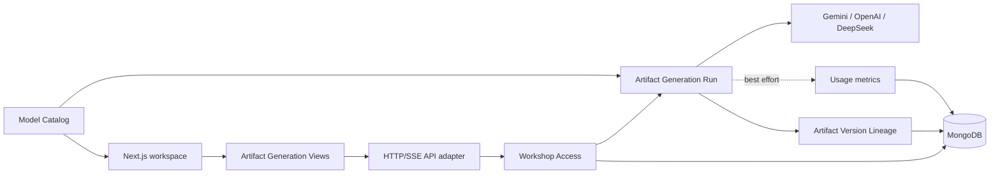

# Technical Architecture

This is the current implementation guide for AI Workshop Playground. Domain language is defined in [CONTEXT.md](./CONTEXT.md).

## System shape

The product is a Next.js workspace backed by an Express API and MongoDB. HTTP and SSE are transport adapters; workshop access, generation completion, model selection, and version lineage live behind application boundaries.


```mermaid
flowchart LR
    UI["Next.js workspace"] --> Views["Artifact Generation Views"]
    Views --> API["HTTP/SSE API adapter"]
    API --> Access["Workshop Access"]
    Access --> Run["Artifact Generation Run"]
    Run --> Providers["Gemini / OpenAI / DeepSeek"]
    Run --> Lineage["Artifact Version Lineage"]
    Run -. best effort .-> Metrics["Usage metrics"]
    Access --> Mongo[(MongoDB)]
    Lineage --> Mongo
    Metrics --> Mongo
    Catalog["Model Catalog"] --> UI
    Catalog --> Run
```

## Application boundaries

| Boundary | Contract | Implementation |
| --- | --- | --- |
| Model Catalog | Ordered Model Options with provider, model, pricing, reasoning capabilities, and current workshop setting | `backend/src/services/modelCatalog.js` |
| Workshop Access | `inspect(credentials)` and `grantForGeneration(credentials)` | `backend/src/services/workshopAccess.js` |
| Artifact Generation Run | Validates the completed artifact, creates its version, then records metrics on a best-effort basis | `backend/src/services/artifactGenerationRun.js` |
| Artifact Version Lineage | Creates, retrieves, and lists participant-owned version lineages | `backend/src/services/artifactVersionLineage.js` |
| SSE adapter | Preserves HTTP headers, event framing, heartbeat, and close behavior | `backend/src/adapters/sseArtifactGeneration.js` |
| Frontend generation interface | `display: AsyncIterable<ArtifactGenerationView>`, `outcome: Promise<ArtifactGenerationOutcome>`, and `cancel()` | `frontend/src/lib/artifactGenerationRun.ts` |
| Artifact Library | Classifies and resolves Starters, Saved Artifacts, and Shared Artifacts into a Workspace Artifact | `frontend/src/lib/artifactLibrary.ts` |

Express middleware and React components adapt these contracts. They should not acquire provider, persistence, quota, or lineage policy.

## Artifact Generation Run

`POST /api/generate` has this order:

1. Validate the request shape.
2. Grant workshop access. Password mode consumes one Workshop Quota unit atomically; participant-key mode validates its request-scoped credentials.
3. Select a Model Option from the Model Catalog.
4. Stream provider output and expose the existing SSE protocol.
5. Parse and validate the terminal structured response.
6. For an edit outcome, create an Artifact Version. A version failure fails the run.
7. Record token and cost metrics. Metrics failure is logged but does not fail a completed run.
8. Emit the terminal outcome and close the SSE response.

The browser converts wire deltas into cumulative Artifact Generation Views. UI consumers do not depend on SSE event ordering or provider SDK types.

### Compatibility contract

Existing clients retain:

- `POST /api/generate` and its SSE event names and payloads.
- Existing validation and error codes.
- Rate-limit response headers.
- Existing browser storage keys and saved identifiers.
- Existing preview, editor streaming, cancellation, and recovery behavior.

The intentional behavior correction is password quota consumption: the maximum is enforced with one conditional MongoDB update, preventing concurrent requests from exceeding the configured maximum.

## Workshop Access

Protected endpoints use one of two operations:

- `inspect` verifies access and reports quota without consuming it. Password validation and version reads use this operation.
- `grantForGeneration` verifies access and reserves generation capacity. Only generation uses this operation.

Participant Model Keys are copied into a request-scoped opaque authorization capability. They are never written to MongoDB, logs, versions, or response payloads. API-key version ownership uses a one-way hash of the participant's access token.

For compatibility during the transition, the Express adapter also exposes the former `req.workshop` view. New application code should use `req.workshopAccessGrant`.

## Model Catalog

The backend catalog is authoritative for nonlocalized model facts:

- stable Model Option ID and ordering;
- provider and provider model ID;
- pricing metadata;
- available and default thinking levels;
- default enabled state;
- display labels and localization key.

`GET /api/models` returns both the legacy enabled-ID array in `models` and the complete catalog in `options`. Participant and admin UIs consume `options`; workshop settings overlay the catalog defaults.

## Artifact Version Lineage

Artifact Version Lineage is the sole authority for ancestry and ownership. A Saved Artifact retains only its current version reference. Legacy `rootVersionId` values in browser storage are tolerated but no longer written or used to construct history.

Relevant endpoints:

- `POST /api/versions/list` lists versions owned by the current participant.
- `POST /api/versions/:versionId` gets one owned version.
- `POST /api/versions/:versionId/lineage` gets the server-resolved lineage for one owned version.

Manual editor changes remain part of the Workspace Artifact. They become durable version history only when a later Artifact Generation Run completes successfully; the resulting version records whether manual edits existed since its parent.

## Artifact Library and browser storage

The Artifact Library has three sources:

- Starters are curated and immutable.
- Shared Artifacts are immutable for the recipient.
- Saved Artifacts are participant-owned and editable.

The first edit or successful generated change to a Starter or Shared Artifact forks it into one Saved Artifact. Further changes update that Saved Artifact. Existing `custom-*`, `shared-*`, `custom-templates`, `shared-templates`, and `current-template-id` values are interpreted lazily, so no eager browser migration is required.

## Persistence

MongoDB models continue to provide storage adapters:

- `Password`: workshop codes, activation, expiry, and per-participant maximum.
- `Usage`: atomic quota consumption and aggregate token usage.
- `CodeVersion`: Artifact Versions and lineage links.
- `RequestLog`: generation metrics and admin reporting.
- `ShareLink`: Shared Artifact payloads.
- `AppSetting`: persisted Model Option workshop settings.

`Usage.consumeWithinLimit` relies on the unique `(passwordId, visitorId)` index. Concurrent first-use upserts retry through the same conditional update; an exhausted condition returns no grant.

## Frontend structure

- `frontend/src/app/page.tsx` coordinates the workspace and adapts domain views to React state.
- `frontend/src/components/workspace/` owns presentation and user interaction.
- `frontend/src/lib/api.ts` owns HTTP and SSE compatibility.
- `frontend/src/lib/artifactGenerationRun.ts` shields the UI from callback and wire-event details.
- `frontend/src/lib/artifactLibrary.ts` owns artifact-source classification and workspace resolution.
- `frontend/src/hooks/` owns local persistence adapters.

Visible model labels continue to use locale translation keys in participant UI. Nonlocalized catalog facts come from the backend.

## Security properties

- Provider keys configured for the workshop remain backend-only.
- Participant Model Keys remain request-scoped and are exposed to provider selection only through an opaque capability.
- Version queries always include a participant ownership filter.
- Generated artifacts run in the existing sandboxed preview iframe.
- Structured artifact edits reject ambiguous, overlapping, no-op, incomplete, and unsafe changes.
- Logs redact recognizable provider-key forms.

## Verification

Backend characterization and boundary tests use Node's built-in test runner:

```powershell
cd backend
npm test
```

Frontend domain tests use Vitest; lint and the production build provide TypeScript and Next.js integration coverage:

```powershell
cd frontend
npm test
npm run lint
npm run build
```

Focused backend tests cover the catalog, access inspection/grants, concurrent quota behavior, generation completion ordering, lineage ownership, and SSE framing. Frontend tests cover cumulative generation views, terminal outcomes, cancellation, artifact classification, source resolution, and fork-on-first-edit planning.

## Change guidance

- Add model facts to the Model Catalog, not controllers or components.
- Add access rules to Workshop Access, not individual routes.
- Add completion invariants to Artifact Generation Run, not the SSE adapter.
- Add ancestry or ownership rules to Artifact Version Lineage, not browser state.
- Keep transport formats stable at adapters and expose cumulative views internally.
- Update [CONTEXT.md](./CONTEXT.md) when introducing or changing domain terminology.
